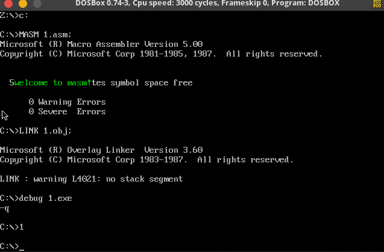
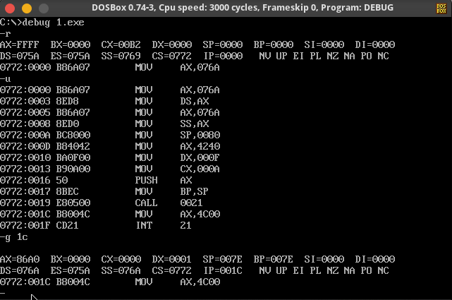
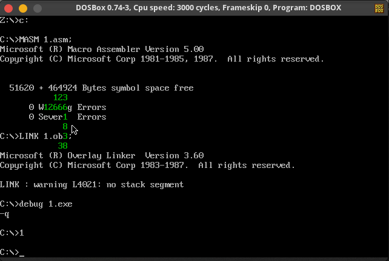
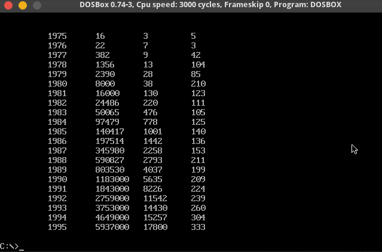

------

# chapter10

## 1. 显示字符串

### 代码

```assembly
assume cs:code,ds:data,ss:stack

data segment
	db 'welcome to masm!',0
data ends

stack segment
	db 128 dup(0)
stack ends

code segment


	start:

    mov ax,stack
    mov ss,ax
    mov sp,128

    mov ax,data
    mov ds,ax
    mov si,0

    mov dh,8;row
    mov dl,3;cul
    mov cl,2;color
    call show_str

    mov ax,4c00h
    int 21h

    show_str:
        push ax
        push dx
        push cx
        push es
        push si
        push di

        mov ax,0b800h
        mov es,ax
        mov di,0

        call get_row
        add di,ax
        call get_cul
        add di,ax

        call show

        pop di
        pop si
        pop es
        pop cx
        pop dx
        pop ax
        ret

    get_row:
        mov al,160
        mul dh
        ret
    get_cul:
        mov al,2
        mul dl
        ret

    show:
        push ax
        push bx
        push cx
        push di
        push si

        sub ax,ax
        sub bx,bx
        

        mov bl,cl
        show_1:
            mov cl,ds:[si]
            mov al,ds:[si]
            mov ch,0
            jcxz ok
            mov ah,bl
            mov es:[di],ax
            add di,2
            inc si
            jmp show_1


        ok:
        pop si
        pop di
        pop cx
        pop bx
        pop ax
        ret

        ret
code ends
end start
```

### 截屏



## 2. 解决除法溢出问题

### 代码

```assembly
assume cs:code,ds:data,ss:stack

data segment
data ends

stack segment
    db 128 dup(0)
stack ends

code segment
    start:
        mov ax,data
        mov ds,ax
        mov ax,stack
        mov ss,ax
        mov sp,128

        mov ax,4240h;L
        mov dx,000fh;H
        mov cx,0ah;N

        push ax;暂时存储ax
        mov bp,sp;记录ax中数据的位置
        call divdw

        mov ax,4c00h
        int 21h

        divdw:

            mov ax,dx
            mov dx,0
            div cx
            push ax

            mov ax,ss:[bp+0];
            div cx
            mov cx,dx

            pop dx

            ret
code ends
end start
```


### 截图



## 3. 数值显示

### 代码

```assembly
assume cs:code,ds:data,ss:stack

data segment
	dw 123,12666,1,8,3,38,0
data ends

string segment
	db 10  dup (0),0	
string ends

stack segment
	db 128 dup(0)
stack ends

code segment


	start:
;初始化
    mov ax,stack
	mov ss,ax
	mov sp,128

    call init_reg

    mov dh,8;row
    mov dl,3;cul
    mov cl,2;color
;显示
    a:
    mov ax,ds:[si]
    mov cx,ax
    jcxz Pro_end
    call dtoc

    inc dh
    mov dl,3;cul
    mov cl,2;color
    call show_str

    call zero

    add si,2
    jmp a

    Pro_end:
    mov ax,4c00h
    int 21h

;把string全部清零
    zero:
				push ax
				push bx
				push cx
				push dx
				push ds
				push es
				push si
				push di

        mov cx,10
        mov ax,string
        mov es,ax
        mov di,0

        lp:
        mov al,0
        mov es:[di],al
        inc di
        loop lp

    zero_ret:
				pop di
				pop si
				pop es
				pop ds
				pop dx
				pop cx
				pop bx
				pop ax
        ret
;==========
    dtoc:
				push ax
				push bx
				push cx
				push dx
				push ds
				push es
				push si
				push di

        mov si,0
        mov dx,0
    dtoc_bg:
        mov cx,10
        div cx
        add dl,30h
        mov es:[si],dl
        mov cx,ax
        jcxz dtoc_end
        inc si
        mov dx,0
        jmp dtoc_bg


    dtoc_end:
				pop di
				pop si
				pop es
				pop ds
				pop dx
				pop cx
				pop bx
				pop ax
        ret
;========
    init_reg:
        mov ax,data
        mov ds,ax
        mov ax,string
        mov es,ax

        mov si,0

        ret

;=======
    show_str:
				push ax
				push bx
				push cx
				push dx
				push ds
				push es
				push si
				push di

        mov ax,string
        mov ds,ax
        mov si,0

        mov ax,0b800h
        mov es,ax
        mov di,0

        call get_row
        add di,ax
        add dl,10
        call get_cul
        add di,ax

        call show

				pop di
				pop si
				pop es
				pop ds
				pop dx
				pop cx
				pop bx
				pop ax
        ret

    get_row:
        mov al,160
        mul dh
        ret
    get_cul:
        mov al,2
        mul dl
        ret

    show:
				push ax
				push bx
				push cx
				push dx
				push ds
				push es
				push si
				push di

        sub ax,ax
        sub bx,bx
        

        mov bl,cl
        show_1:
            mov cl,ds:[si]
            mov al,ds:[si]
            mov ch,0
            jcxz ok
            mov ah,bl
            mov es:[di],ax
            sub di,2
            inc si
            jmp show_1


        ok:
				pop di
				pop si
				pop es
				pop ds
				pop dx
				pop cx
				pop bx
				pop ax
        ret

code ends
end start
```


### 截图

# 课程设计1

### 代码

```assembly
assume cs:code,ds:data,ss:stack

data segment
		;0,0
		db	'1975','1976','1977','1978','1979','1980','1981','1982','1983'
		db	'1984','1985','1986','1987','1988','1989','1990','1991','1992'
		db	'1993','1994','1995'
		;以上是表示21年的21个字符串 year

		;84,54h
		dd	16,22,382,1356,2390,8000,16000,24486,50065,97479,140417,197514
		dd	345980,590827,803530,1183000,1843000,2759000,3753000,4649000,5937000
		;以上是表示21年公司总收入的21个dword数据	sum

		;168,a8
		dw	3,7,9,13,28,38,130,220,476,778,1001,1442,2258,2793,4037,5635,8226
		dw	11542,14430,15257,17800
data ends


stack segment
	db 128 dup(0)
stack ends


table segment	;0123456789ABCDEF
	db	21 dup ('year summ ne ?? ')
table ends

string segment ;0123456789ABCDEF
	db	21 dup (0000000000000000)
string ends


code segment
start:  
			mov ax,stack;stack
			mov ss,ax
			mov sp,128
			
			call clear_screen;清空屏幕
			
			call init_reg;初始化寄存器组，把数据导入

			call input_table;把数据格式化存储

			call output_table;输出格式化数据
			
			mov ax,4C00H
			int 21H

;================================;output_table
output_table:
			push ax
			push bx
			push cx
			push dx
			push es
			push ds
			push di
			push si

	output_table_bg:
			;分别调用显示子程序
			call print_year;年
			call print_income;总收入
			call print_employee;员工数量
			call print_avg;人均收入

	output_table_end:
			pop si
			pop di
			pop ds
			pop es
			pop dx
			pop cx
			pop bx
			pop ax
			ret
	;=============================================
	print_avg:
			push ax
			push bx
			push cx
			push dx
			push es
			push ds
			push di
			push si

			mov ax,table
			mov ds,ax
			mov ax,string
			mov es,ax

			mov si,0

		print_avg_bg:

			mov cx,21
			mov di,160*3+2*40;在屏幕中的显示位置
		pa_lp1:
			push cx
			
			mov ax,ds:[si+13]
			mov dx,0
			mov cx,10

			call transfer;改进后的子程序3

			add si,16
			add di,160
			pop cx
			loop pa_lp1

			pop si
			pop di
			pop ds
			pop es
			pop dx
			pop cx
			pop bx
			pop ax
			ret

	;=============================================
	print_employee:
			push ax
			push bx
			push cx
			push dx
			push es
			push ds
			push di
			push si

			mov ax,table
			mov ds,ax
			mov ax,string
			mov es,ax

			mov si,0

		print_employee_bg:
			mov cx,21
			mov di,160*3+2*30

		peb_lp1:	
			push cx
			
			mov ax,ds:[si+10]
			mov dx,0
			mov cx,10

			call transfer

			add si,16
			add di,160
			pop cx
			loop peb_lp1

		print_employee_end:
			pop si
			pop di
			pop ds
			pop es
			pop dx
			pop cx
			pop bx
			pop ax
			ret

	;=============================================
	print_income:
			push ax
			push bx
			push cx
			push dx
			push es
			push ds
			push di
			push si

			mov ax,table
			mov ds,ax
			mov ax,string
			mov es,ax

			mov si,0

			
		print_income_bg:

			mov cx,21
			mov di,160*3+2*20
		pib_lp1:
			push cx
			
			mov ax,ds:[si+5]
			mov dx,ds:[si+7]
			mov cx,10


			call transfer

			add si,16
			;add di,16
			add di,160
			pop cx
			loop pib_lp1


		print_income_end:
			pop si
			pop di
			pop ds
			pop es
			pop dx
			pop cx
			pop bx
			pop ax
			ret

		;==============================
		transfer:
			push ax
			push bx
			push cx
			push dx
			push es
			push ds
			push di
			push si

			mov bx,15
			
		transfer_bg:	;判断是否大于一个字节	
			mov cx,dx
			jcxz short_div;不大于一个字节

			mov cx,10
			push ax
			mov bp,sp
			call divdw
			add sp,2

			add cl,30h
			mov es:[bx],cl

			dec bx
			jmp transfer_bg
		sn:
			call show_number;输出结果

		transfer_end:
			pop si
			pop di
			pop ds
			pop es
			pop dx
			pop cx
			pop bx
			pop ax
			ret
		;===================
		show_number:
			push ax
			push bx
			push cx
			push dx
			push es
			push ds
			push di
			push si

			mov ax,string
			mov ds,ax
			mov ax,0b800h
			mov es,ax


		sn_lp1:
			mov cx,0
			mov cl,ds:[bx]
			jcxz show_number_end
			mov ch,00000111b
			mov es:[di],cx
			
			inc bx
			add di,2

			jmp sn_lp1

		show_number_end:
			pop si
			pop di
			pop ds
			pop es
			pop dx
			pop cx
			pop bx
			pop ax
			ret

		;===================
		divdw:

		mov ax,dx
		mov dx,0

		div cx
		push ax
		mov ax,ss:[bp+0]
		div cx

		mov cx,dx
		pop dx

		ret

		;===================
		short_div:
		mov cx,10
		div cx
		add dl,30h
		mov es:[bx],dl
		mov cx,ax
		jcxz sn
		dec bx
		mov dx,0
		jmp short_div

	;=============================================
	print_year:
			push ax
			push bx
			push cx
			push dx
			push es
			push ds
			push di
			push si

			;0123456789ABCDEF
			;year summ ne ?? 

		print_year_bg:
			mov ax,table
			mov ds,ax
			mov ax,0b800h
			mov es,ax
			mov si,0
			mov di,160*3+2*10

			mov cx,21
		pyb_lp1:
			push cx
			mov cx,4
			mov bx,0
		pyb_lp2:
			mov al,ds:[si+bx]
			;mov ah,00000111b
			mov ah,00000111b
			push bx
			add bx,bx
			mov es:[di+bx],ax
			pop bx

			inc bx
			loop pyb_lp2
			
			add si,16
			add di,160
			pop cx
			loop pyb_lp1

		print_year_end:
			pop si
			pop di
			pop ds
			pop es
			pop dx
			pop cx
			pop bx
			pop ax
			ret

;================================;input_table
input_table:
			push ax
			push bx
			push cx
			push dx
			push es
			push ds
			push di
			push si

			mov si,0
			mov di,0
			mov bx,21*4*2

			mov cx,21


				;0123456789ABCDEF
				;year summ ne ?? 
	input_table_bg:		
			;year
			push ds:[si+0]
			pop es:[di+0]
			push ds:[si+2]
			pop es:[di+2]
			;income
			mov ax,ds:[si+21*4+0]
			mov dx,ds:[si+21*4+2]
			mov es:[di+5],ax
			mov es:[di+7],dx
			;employee
			push ds:[bx]
			pop es:[di+10]
			;avg
			div word ptr ds:[bx]
			mov es:[di+13],ax

			add si,4
			add di,16
			add bx,2

			loop input_table_bg
	input_table_end:
			pop si
			pop di
			pop ds
			pop es
			pop dx
			pop cx
			pop bx
			pop ax
			ret


;==============================初始化寄存器组，把数据导入
init_reg:		
			mov bx,data;data in
			mov ds,bx
			mov bx,table;data out
			mov es,bx
			ret

;===================================清空屏幕
clear_screen:	
			mov bx,0b800h
			mov es,bx
			
			mov bx,0
			mov dx,0000h
			mov cx,2000
					
	clearScreen:	
					mov es:[bx],dx
					add bx,2
					
					loop clearScreen
					
					ret
code ends

end start
```


### 截图



