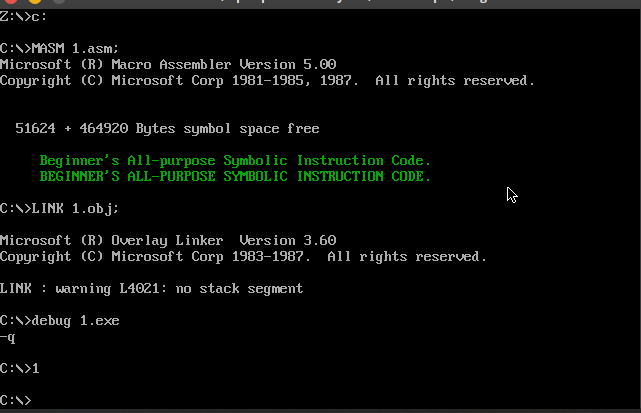

# chapter 11

## 实验11

### code

```assembly
assume cs:code,ds:data

data segment
    db "Beginner's All-purpose Symbolic Instruction Code.",0
data ends


code segment
start:
    mov ax,data
    mov ds,ax
    mov si,0
	mov di,160*10+2*5

    call show_letter
    call letterc
	add di,160
    call show_letter

    mov ax,4c00h
    int 21h

    letterc:
        push ax
        push bx
        push cx
        push dx
        push si
        push di
        push ds
        push es

        mov si,0

    letterc_bg:
        mov al,ds:[si]

        cmp al,0
        je letterc_end

        cmp al,'a'
		jb next
		cmp al,'z'
		ja next
		;and al,11011111b
        sub al,20h
		mov ds:[si],al

        next:
            inc si
            jmp letterc_bg
    letterc_end:
        pop es
        pop ds
        pop di
        pop si
        pop dx
        pop cx
        pop bx
        pop ax
        ret

    show_letter:
        push ax
        push bx
        push cx
        push dx
        push si
        push di
        push ds
        push es
    show_letter_bg:
        mov ax,0b800h
        mov es,ax
        ; mov di,160*10+2*5

		mov cx,0

        show:
            mov al,ds:[si]

            mov cl,al
			jcxz show_letter_end
            
            mov ah,2
            mov es:[di],ax
            inc si
            inc di
            inc di
            jmp show

    show_letter_end:
        pop es
        pop ds
        pop di
        pop si
        pop dx
        pop cx
        pop bx
        pop ax
        ret
code ends
end start
```

### Screenshot

