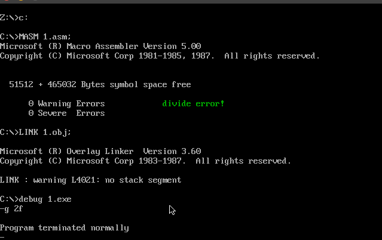

# chapter12

## 代码

```assembly
assume cs:code

code segment
start:


    call transfer

    ;demo
    mov ax,1000h
    mov bh,1
    div bh

    mov ax,4c00h
    int 21h
;=================================================
transfer:
    ;mov d0
    mov ax,cs
    mov ds,ax
    mov si,offset do0

    mov ax,0
    mov es,ax
    mov di,200h

    mov cx,offset do0_end - offset do0

    cld
    rep movsb

    ;set int table
    mov ax,0
    mov es,ax
    mov word ptr es:[0*4],200h
    mov word ptr es:[0*4+2],0

    ret

;===========================================
do0:
    jmp short do0_bg
    db 'divide error!'
do0_bg:

    mov ax,cs
    mov ds,cx
    mov si,202h

    mov ax,0b800h
    mov es,ax
    mov di,160*12+2*34

    mov cx,13
    s:
        mov al,ds:[si]
        mov ah,2
        mov es:[di],ax
        inc si
        add di,2
        loop s

    mov ax,4c00h
    int 21h

do0_end:
    nop

code ends
end start
```

## 截屏

