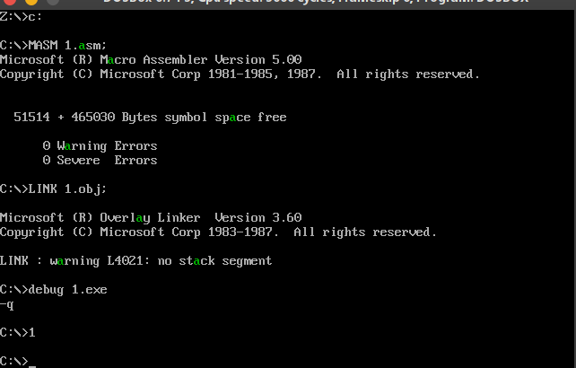

# 问题一

当作有符号数来计算（最高位为正负表示位），设置SF来看结果的正负

# 问题二

`1000 0000`

`1000 0000` 取反后为 `0111 1111` 加一后 `1000 0000` 为 128 时 -128 的绝对值

- 负数的补码为其绝对值


# 问题三

## 思路

把显存中的每一个字符拿出来和 **a** 比较一下

## 代码

```assembly
assume cs:code

code segment
start:

    call a_green

    mov ax,4c00h
    int 21h

    a_green:
    push ax
    push bx
    push cx
    push dx
    push ds
    push es
    push si
    push di
    a_green_bg:
        mov ax,0b800h
        mov ds,ax
        mov si,0

        mov cx,2000
        lp:
            mov al,ds:[si]
            cmp al,'a'
            jne lp_end
            mov byte ptr ds:[si+1],2

        lp_end:
            inc si
            inc si
            loop lp
    a_green_end:
        pop di
        pop si
        pop es
        pop ds
        pop dx
        pop cx
        pop bx
        pop ax
		ret
code ends
end start
```

## 截屏

