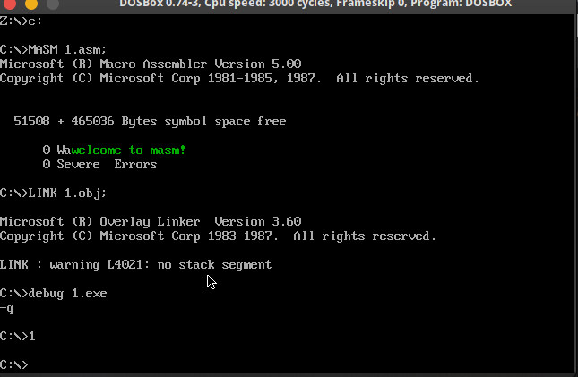
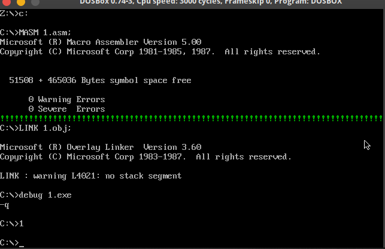
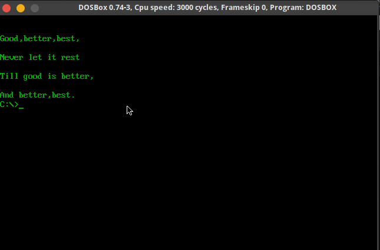

# chapter 13

## 1.

### code

```assembly
assume cs:code,ss:stack,ds:data

data segment
    db 'welcome to masm!',0
data ends

stack segment
    db 128 dup(0)
stack ends

code segment
start:
    mov ax,stack
    mov ss,ax
    mov sp,128

    call transfer
    call test_application

    mov ax,4c00h
    int 21h

;=======================================
test_application:
    push ax
    push bx
    push cx
    push dx
    push ds
    push es
    push si
    push di
    test_application_bg:
        mov dh,10;row
        mov dl,10;cul
        mov cl,2 ;color
        mov ax,data;ds:si
        mov ds,ax
        mov si,0
        int 7ch
    test_application_end:
        pop di
        pop si
        pop es
        pop ds
        pop dx
        pop cx
        pop bx
        pop ax
        ret
;=======================================
transfer:
    push ax
    push bx
    push cx
    push dx
    push ds
    push es
    push si
    push di
    transfer_bg:
        ;mov 7ch
        mov ax,cs
        mov ds,ax
        mov si,offset int_7ch

        mov ax,0
        mov es,ax
        mov di,200h

        mov cx,offset int_7ch_end - offset int_7ch

        cld
        rep movsb

        ;set int table
        mov ax,0
        mov es,ax
        mov word ptr es:[7ch*4],200h
        mov word ptr es:[7ch*4+2],0
    transfer_end:
        pop di
        pop si
        pop es
        pop ds
        pop dx
        pop cx
        pop bx
        pop ax
        ret

;===================================
int_7ch:
    push ax
    push bx
    push cx
    push dx
    push ds
    push es
    push si
    push di
    int_7ch_bg:
        mov ax,0b800h
        mov es,ax
        mov di,0
        call get_row
        add di,ax
        call get_cul
        add di,ax


        s0:
            mov al,ds:[si]
            cmp al,0
            je end_0
            mov ah,cl
            mov es:[di],ax
            inc si
            inc di
            inc di
            jmp s0

        end_0:
        pop di
        pop si
        pop es
        pop ds
        pop dx
        pop cx
        pop bx
        pop ax
        iret

    get_row:
        mov al,160
        mul dh
        ret
    get_cul:
        mov al,2
        mul dl
        ret
    int_7ch_end:
        nop

code ends
end start
```

### 截屏



## 2.

### code

```assembly
assume cs:code,ss:stack,ds:data

data segment
    db 'welcome to masm!',0
data ends

stack segment
    db 128 dup(0)
stack ends

code segment
start:
    mov ax,stack
    mov ss,ax
    mov sp,128

    call transfer
    call test_application

    mov ax,4c00h
    int 21h

;=======================================
test_application:
    push ax
    push bx
    push cx
    push dx
    push ds
    push es
    push si
    push di
    test_application_bg:
        mov ax,0b800h
        mov es,ax
        mov di,160*12 ;position
        mov bx,offset s - offset test_application_end ;length
        mov cx,80 ;times
        s:
            mov byte ptr es:[di],'!'
            mov byte ptr es:[di+1],2
            add di,2
            int 7ch
    test_application_end:
        pop di
        pop si
        pop es
        pop ds
        pop dx
        pop cx
        pop bx
        pop ax
        ret
;=======================================
transfer:
    push ax
    push bx
    push cx
    push dx
    push ds
    push es
    push si
    push di
    transfer_bg:
        ;mov 7ch
        mov ax,cs
        mov ds,ax
        mov si,offset int_7ch

        mov ax,0
        mov es,ax
        mov di,200h

        mov cx,offset int_7ch_end - offset int_7ch

        cld
        rep movsb

        ;set int table
        mov ax,0
        mov es,ax
        mov word ptr es:[7ch*4],200h
        mov word ptr es:[7ch*4+2],0
    transfer_end:
        pop di
        pop si
        pop es
        pop ds
        pop dx
        pop cx
        pop bx
        pop ax
        ret

;===================================
int_7ch:
    push ax
    push bx
    push dx
    push ds
    push es
    push si
    push di
    int_7ch_bg:

        push bp
        mov bp,sp
        dec cx
        jcxz end_7ch
        add [bp+2*8],bx


        end_7ch:

        pop bp

        pop di
        pop si
        pop es
        pop ds
        pop dx
        pop bx
        pop ax
        iret
    int_7ch_end:
        nop

code ends
end start
```

### 截屏



## 3.

### code

```assembly
assume cs:code

code segment
s1: db  'Good,better,best,','$'
s2: db  'Never let it rest','$'
s3: db  'Till good is better,','$'
s4: db  'And better,best.','$'
s:  dw  offset s1,offset s2,offset s3,offset s4
row:    db 2,4,6,8

start:

        call clear_screen
        call show

        mov ax,4c00h
        int 21h

show:
    push ax
    push bx
    push cx
    push dx
    push ds
    push es
    push si
    push di
    show_bg:
        mov ax,cs
        mov ds,ax
        mov bx,offset s
        mov si,offset row
        mov cx,4
    ok: mov bh,0
        mov dh,ds:[si]
        mov dl,0
        mov ah,2
        int 10h

        mov dx,ds:[bx]
        mov ah,9
        int 21h

        inc si
        add bx,2

        loop ok
    show_end:
        pop di
        pop si
        pop es
        pop ds
        pop dx
        pop cx
        pop bx
        pop ax
		ret

clear_screen:
    push ax
    push bx
    push cx
    push dx
    push ds
    push es
    push si
    push di
    clear_screen_bg:
			mov bx,0b800h
			mov es,bx

			mov bx,0
			mov dl,0
            mov dh,00000010b
			mov cx,2000

	clearScreen:
					mov es:[bx],dx
					add bx,2

					loop clearScreen

    clear_screen_end:
        pop di
        pop si
        pop es
        pop ds
        pop dx
        pop cx
        pop bx
        pop ax
		ret


code ends

end start
```

### 截屏


