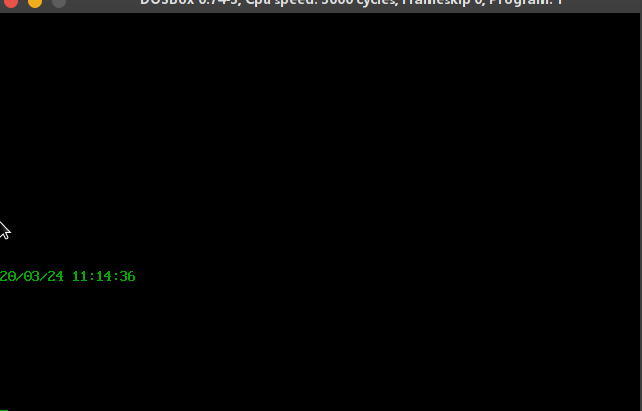

# chapter14

## 1. 访问CMOS RAM 

### code

```assembly
assume cs:code,ds:data,ss:stack

stack segment
	db 128 dup(0)
stack ends

data segment
    db 'YY/MM/DD hh:mm:ss',0
data ends


code segment

TIME_CMOS:  db  9,8,7,4,2,0

start:
    mov ax,stack
    mov ss,ax
    mov sp,128

    call clear_screen
    call show_init
    stime:
    call show_time
    jmp stime
    mov ax,4c00h
    int 21h

;=============================
show_time:
    push ax
    push bx
    push cx
    push dx
    push ds
    push es
    push si
    push di
    show_time_bg:
        mov ax,0b800h
        mov es,ax
        mov di,16*160

        mov ax,cs
        mov ds,ax
        mov si,offset TIME_CMOS

        mov cx,6
        s1:
            push cx

            mov al,ds:[si]
            out 70h,al
            in al,71h

            mov ah,al
            mov cl,4
            shr ah,cl
            and al,00001111b

            add ah,30h
            add al,30h

            mov byte ptr es:[di],ah
            mov byte ptr es:[di+2],al

            inc si
            add di,6

            pop cx
            loop s1

    show_time_end:
        pop di
        pop si
        pop es
        pop ds
        pop dx
        pop cx
        pop bx
        pop ax
		ret
;==============================
show_init:
    push ax
    push bx
    push cx
    push dx
    push ds
    push es
    push si
    push di
    show_init_bg:
        mov ax,data
        mov ds,ax
        mov si,0

        mov ax,0b800h
        mov es,ax
        mov di,16*160

        s:
            mov al,ds:[si]
            cmp al,0
            je show_init_end
            mov ah,2
            mov es:[di],ax
            inc si
            inc di
            inc di
            jmp s
    show_init_end:
        pop di
        pop si
        pop es
        pop ds
        pop dx
        pop cx
        pop bx
        pop ax
		ret
;==============================
clear_screen:
    push ax
    push bx
    push cx
    push dx
    push ds
    push es
    push si
    push di
    clear_screen_bg:
			mov bx,0b800h
			mov es,bx
			
			mov bx,0
			mov dl,0
            mov dh,00000010b
			mov cx,2000

	clearScreen:	
					mov es:[bx],dx
					add bx,2
					
					loop clearScreen
	
    clear_screen_end:
        pop di
        pop si
        pop es
        pop ds
        pop dx
        pop cx
        pop bx
        pop ax
		ret
code ends
end start
```

### 截屏

