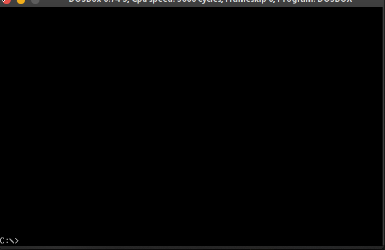
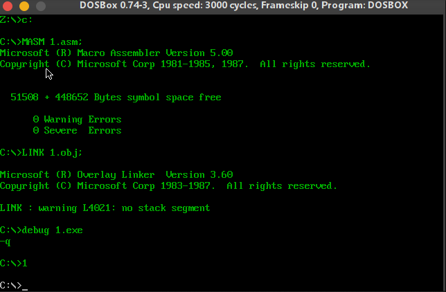
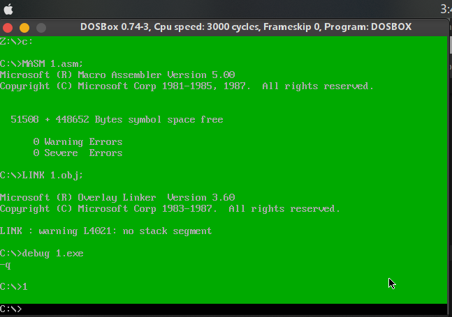
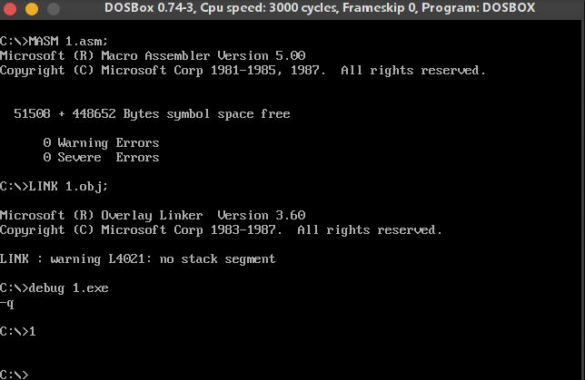

# chapter16

## 代码

```assembly
assume cs:code,ds:data,ss:stack

stack segment
    db 128 dup (0)
stack ends

data segment
data ends

code segment
start:

    mov ax,stack
    mov ss,ax
    mov sp,128

    call install_int

    mov al,4
    mov ah,3
    int 7ch

    mov ax,4c00h
    int 21h

;====== install_int =========
install_int:
    install_int_bg:
        mov ax,0
        mov es,ax

        cli
        mov word ptr es:[7ch*4],200h
        mov word ptr es:[7ch*4+2],0
        sti


        ;load
        push cs
        pop ds

        mov ax,0
        mov es,ax

        mov si,offset int7ch
        mov di,200h
        mov cx,offset int7ch_end - offset int7ch
        cld
        rep movsb

    install_int_end:
        ret

;============ int7ch ======================
int7ch:
    jmp int7ch_code

    Mytable dw offset clear_screen - offset int7ch + 200h
            dw offset set_front_color - offset int7ch + 200h
            dw offset set_background_color - offset int7ch + 200h
            dw offset move_up - offset int7ch +200h
    ;==============
    int7ch_code:
        push ax
        push bx
        push es
        int7ch_bg:
            ; call clear_screen
            ; call set_front_color
            ; call set_background_color
            ; call move_up


            cmp ah,3
            ja int7ch_ret
            mov bl,ah
            mov bh,0
            add bx,bx
            add bx,offset Mytable - offset int7ch + 200h

            call word ptr es:[bx]


        int7ch_ret:
            pop es
            pop bx
            pop ax
            iret

    ;============ clear_screen s============
    clear_screen:
        push ax
        push bx
        push cx
        push dx
        push ds
        push es
        push si
        push di

        clear_screen_bg:
                mov bx,0b800h
                mov es,bx
                
                mov bx,0
                mov cx,2000
        cs_lp1:
                mov byte ptr es:[bx],' '
                add bx,2
                loop cs_lp1
        clear_screen_end:
            pop di
            pop si
            pop es
            pop ds
            pop dx
            pop cx
            pop bx
            pop ax
            ret
    ;=========== set_front_color ================
    set_front_color:
        push ax
        push bx
        push cx
        push dx
        push ds
        push es
        push si
        push di
        set_front_color_bg:
            mov bx,0b800h
            mov es,bx
            mov bx,1
            mov cx,2000
            ; mov al,2
            sfc_lp1:
                and byte ptr es:[bx],11111000b
                or es:[bx],al
                add bx,2
                loop sfc_lp1
        set_front_color_end:
            pop di
            pop si
            pop es
            pop ds
            pop dx
            pop cx
            pop bx
            pop ax
            ret
    ;========== set_background_color =================
    set_background_color:
        push ax
        push bx
        push cx
        push dx
        push ds
        push es
        push si
        push di
        set_background_color_bg:
            mov cl,4
            shl al,cl

            mov bx,0b800h
            mov es,bx
            
            mov bx,1
            mov cx,2000
            ; mov al,15
            sbc_lp1:
                and byte ptr es:[bx],10001111b
                or es:[bx],al
                add bx,2
                loop sbc_lp1
        set_background_color_end:
            pop di
            pop si
            pop es
            pop ds
            pop dx
            pop cx
            pop bx
            pop ax
            ret

    ;============== move up ========================
    move_up:
        push ax
        push bx
        push cx
        push dx
        push ds
        push es
        push si
        push di
        move_up_bg:
            mov si,0b800h
            mov es,si
            mov ds,si

            mov si,160
            mov di,0

            cld
            mov cx,24

            mub_lp1:
                push cx
                mov cx,160
                rep movsb
                pop cx
                loop mub_lp1

            mov cx,80
            mov si,0
            mub_lp2:
                mov byte ptr [160*21+si],' '
                add si,2
                loop mub_lp2
        move_up_end:
            pop di
            pop si
            pop es
            pop ds
            pop dx
            pop cx
            pop bx
            pop ax
            ret

    ;======== 
    int7ch_end:
        nop


code ends
end start
```

## 截屏

###  0 清屏



### 1 设置前景色



### 2 设置背景色



### 3 向上滚动一行

