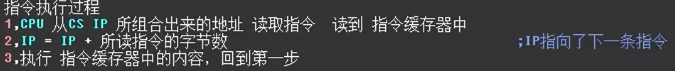

# ret 和 call

-------------------------------

* 指令执行过程
  * 

**通过栈中的数据来修改 cs  和 ip 同时还会 修改栈顶标志**

## ret（用栈中的数据）

----

- **弹栈**

1. 近转移 ret 修改 IP ***pop ip***
   1. $ (ip)=((ss)*16+(sp)) $
   2. $ (sp)=(sp)+2 $
2. 远转移 retf 修改 cs:ip ***pop ip,pop cs***
   1. $ (ip)=((ss)*16+(sp)) $
   2. $(sp)=(sp)+2$
   3. $(cs)=((ss)*16+(sp))$
   4. $(sp)=(sp)+2$

## call(不能实现短转移)

---

- 类似**jmp**
- call程序处理的数据一般要进行压栈


### 1.根据位移进行转移

---

```assembly
push ip
jmp near ptr 标号
```

- 执行过程 原理
  - call下一条指令的IP压栈后，转到标号处

### 2.转移目的地址在指令中

---

```assembly
call far ptr
```

- 执行过程 原理
  - call下一条指令的CS:IP压栈后，转到标号处

### 3.转移地址在寄存器中

----

```assembly
call 16 位 reg
```


- 执行过程 原理
  - call下一条指令的IP压栈后，转到==reg== 处

### 4. 转移地址在内存中

----

#### 1

-----

```assembly
call word ptr 内存单元地址
```

- 执行过程 原理
  - call下一条指令的IP压栈后，转到==内存单元地址==

#### 2

-----

```assembly
call dword ptr 内存单元地址
```

- 执行过程 原理
  - call下一条指令的CS:IP压栈后，转到标号处

## call 和 ret 共同应用

---

- 就像函数调用

### 批量数据处理

----

```assembly
assume cs:code,ds:data,ss:stack

data segment
	db 'conversation'
data ends

stack segment
	db 16 dup(0)
stack ends

code segment


	start:  mov ax,data
			mov ds,ax
			mov si,0
			mov cx,12
			call capital
			mov ax,4c00h
			int 21h

	capital: and byte ptr ds:[si],11011111b
			 inc si;
			 loop capital
			 ret


code ends


end start
```

### 寄存器冲突问题

----

* 在子程序执行开头，把所需要用到的寄存器压栈
* 在子程序完成后，从栈中弹出各个寄存其的值

```assembly
assume cs:code,ds:data,ss:stack

data segment
	db 'word',0
	db 'unix',0
	db 'wind',0
	db 'good',0
data ends

stack segment
	db 128 dup(0)
stack ends

code segment


	start:  mov ax,data
			mov ds,ax

			mov cx,4
			mov bx,0

	s:      mov di,bx
			call capital
			add bx,5
			loop s

			mov ax,4c00h
			int 21h

	capital: push cx;执行子程序前压栈
			 push si

	change:	 mov cl,ds:[si]
			 mov ch,0
			 jcxz ok
			 and byte ptr ds:[si],11011111b
			 inc si
			 jmp change

		ok:	 pop si;执行完后弹栈
			 pop cx
			 ret


code ends


end start
```

## mul

---

### 1. 8位

----

> 一个默认放在==AL==，另一个放在==内存字节单元==或者==8位reg==。
>
> 结果 默认 ==AX==。

### 2. 16位

> 一个默认放在==AX==，另一个放在==内存字单元==或者==16位reg==。
>
> 结果 默认 高位在==DX== ，低位在==AX==。

## 模块化程序设计

----

- 通过==ret==,==call==.

### 参数和结果的传递

```assembly
assume cs:code,ds:data,ss:stack

data segment
	dw 1,2,3,4,5,6,7,8
	dd 0,0,0,0,0,0,0,0
	db 'word',0
	db 'unix',0
	db 'wind',0
	db 'good',0
data ends

stack segment
	db 128 dup(0)
stack ends

code segment


	start:  mov ax,data
			mov ds,ax
			mov si,0
			mov bp,0
			call r_start


			mov ax,4c00h
			int 21h


	r_start:	mov bx,ds:[si]
				call cube
				mov ds:[16+bp],ax
				add si,2
				add bp,4
				loop r_start
				ret

		cube:	mov ax,bx
				mul bx
				mul bx
				ret

```
