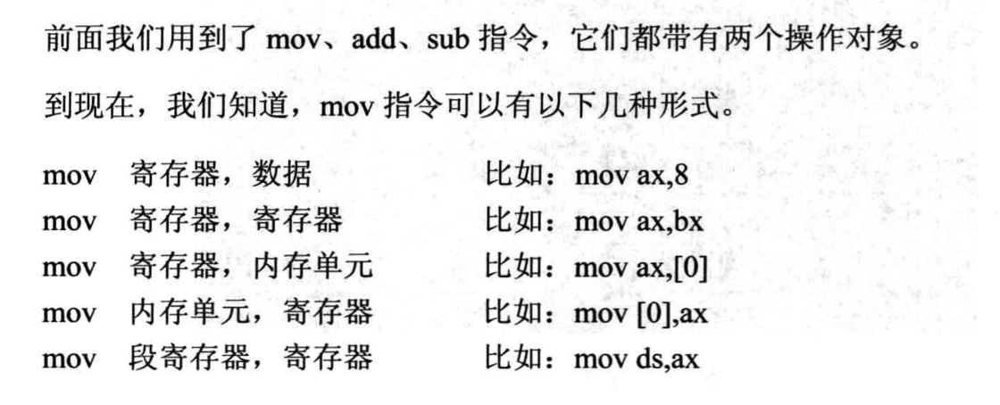

# 寄存器（内存访问）

------------

#### 3个段

------------
## 数据段

### 1. 字的存储
> 一次存放两个字节
> 
### 2.    
> 内存地址由 **段地址** 和 **偏移地址** 构成
> 其中段地址默认保存在DS寄存器当中
> 偏移地址由 **[address]** 保存告知
> 

### 3. mov，add，sub 指令



### 4. -d 段地址：偏移地址

### 5. 在内存中存放自己定义的数据，通过 ***ds和[]*** 来 让CPU访问数据

## 代码段


### 1. 段地址存放在cs寄存器中
### 2. 偏移地址存放在ip寄存器当中
### 3. 内存中存放代码
### 4. 修改cs:ip中的值就可使CPU执行代码

## 栈段

### 1. 栈的作用 


1. 临时性保存数据
2. 进行数据交换


  ```assembly
-a
mov ax,1000
mov bx,2000
push ax
push bx
pop ax
pop bx
  ```

### 2. 栈的寄存器ss:sp
### 3. 操作指令push&ip
> push 执行过程
>> 1.sp=sp-2（栈顶标记）
>> 2.传入字型数据
> 
> pop 执行过程
>> 1.传出字或字节
>> 2.sp=sp+2(栈顶标记）
> 
> 栈顶标记 在 数据（内存地址）的上面 的 内存地址
> sp 偏移地址寄存器 ss 段地址寄存器

### 4. 处理数据时要 ，临时存放数据
### 5. 修改ss:sp中的值，决定栈顶位置，CPU在执行的过程中把我们定义的栈段当作栈使用
### 6. 一段连续的内存地址
### 7. 栈的容量的最大极限
> sp 的变化范围 0~ffffH 32768 个字型数据
> call 将指令IP 保存到内存的哪里？  ret 可以拿回
>> 保存到栈中 为了让 ret 从栈中取回
>> 

### 8.每执行 一条 -t 指令 就会将寄存器的值保存到 栈中

## 内存的安全访问 

1. 安全空间 0：200~0: 2ffH
2. 内存分配的时间 1. 系统加载程序的时候 为程序分配的内存。2. 程序执行过程中，向系统再去要内存空间

# 承上启下
------

- 我们可以把内存任意的划分为 栈，数据，指令 ，他们可以是同一块内存，亦可以是不同的内存
- cpu 通过 ss:sp 所指向的 内存作为 栈
- ds:[] 所指向的 内存 作为数据
- cs:ip 所指向的 内存 作为指令 

**指令从哪里？数据从哪来？临时性的数据存放到哪里？**
