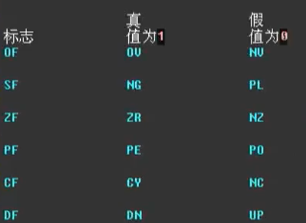
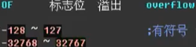

# 标志寄存器

-----

>  

----


## CF标志位**Carry Flag**

  - 
  - 进位（最高位进位）add
  - 和运算相关的指令会影响标志位 like ==add , sub==
  - 把操作数当作无符号数字

## ZF标志位**Zero Flag**

  - 
  
- 判断相等
  
- 最后结果是否为零
  
## PF标志位**pairty Flag**
  - 一的个数是否位偶数0 or 奇数1
  - 

## SF标志位**Sign Flag**
  - 正0负1
  - 
  - 计算的结果看陈整数和负数
  - add sub 影响sf
  - mul 不影响sf

## OF标志位**Overflow**

  - 
  - 运算过程中看是否溢出
  - 两个操作数都当做有符号 运算过程中决定是否溢出

## adc 带进位的加法寄存器

  - 可以对更大的数字进行加法运算

## sbb 带借位减法

  - 实现对更大数的减法

## cmp 比较指令

  - 类似于减法指令 只是不保存结果，只是影响相关的标志位寄存器

  - 可以判断两个操作数的大小 通过 sf of 标志位

    > |  sf  |  of  | 大小 |
    > | :--: | :--: | :--: |
    > |  1   |  0   | 1<2  |
    > |  0   |  1   | 1<2  |
    > |  1   |  1   | 1>2  |
    > |  0   |  0   | 1>2  |

- 检测比较结果的转移指令

  - 和 cmp指令配合使用
    - > | 指令 |   含义    | 检测相关的标志位 |
      > | :--: | :-------: | :--------------: |
      > |  je  |   equal   |       zf=1       |
      > | jne  | not equal |       zf=0       |
      > |  jb  |   below   |       cf=0       |
      > | jnb  | not below |       cf=1       |
      > |  ja  |   above   |   cf=0 && zf=1   |
      > | jna  | not above |  cf=1 \|\| zf=1  |
  
## DF 标志和串传送指令

  - movsb 

  - movsw 

  - 配合rep 使用 rep like loop 由cx 的大小决定 执行 上述 两条指令的 次数 

    - exp 

        ```assembly
        ;-========movsb=====
        mov cx,16
        rep movsb
        ;循环16次 每次执行完后 si di ++
        ```

        ```assembly
        ;========movsw
        mov cx,16
        rep movsw
        ;循环16次每次 执行完 si,di --
        ```

  - cld -> df==0**++**
  
  - std -> df==1**--**

## pushf && popf

  - 使 标志位寄存器 压栈和出栈


